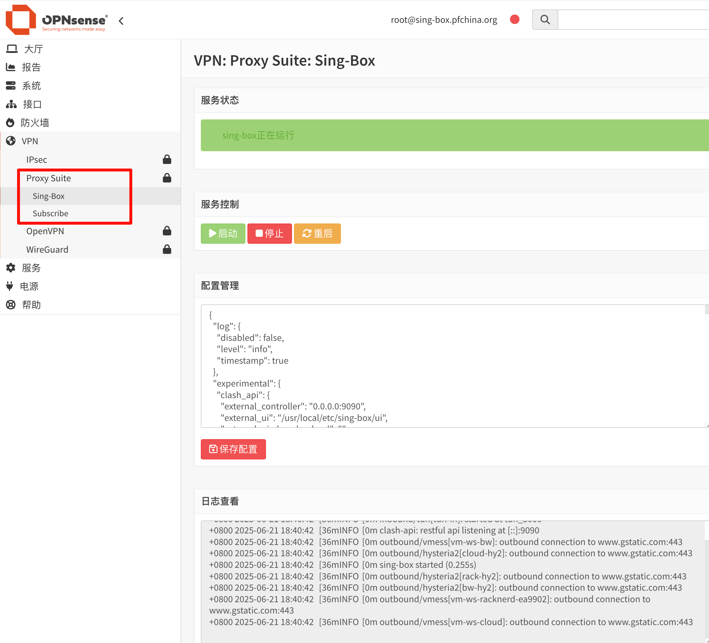
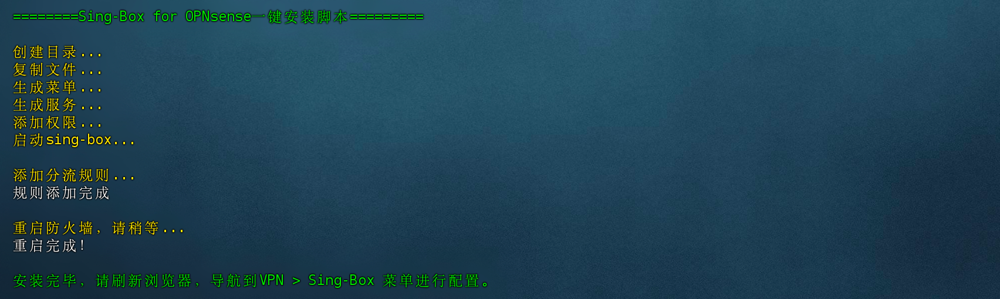

## Sing-box for OPNsense
sing-box安装工具，在OPNsense上实现透明代理功能。在OPNsense 25.1.8上测试通过。



## 程序版本
[Vincent-Loeng大佬魔改Sing-Box](https://github.com/Vincent-Loeng/sing-box) 

## 注意事项
1. 当前仅支持x86_64 平台。
2. 脚本不提供任何节点信息，请准备好自己的出站配置文件。
3. 脚本会自动添加tun接口、分流规则，安装完成后可以手动修改。
4. 脚本集成配置模板，只需补充出站部分的配置部分配置即可使用。
5. 由于sing-box不同版本的配置有差异，已发布Release的配置文件只针对安装程序的版本。
6. 为减少长期运行保存的日志数量，在调试完成后，请将配置的日志类型修改为error或warn。

## 安装命令

```bash
sh install.sh
```


## 卸载命令

```bash
sh uninstall.sh
```
## 配置教程

[OPNsense 配置 sing-box 透明代理教程](https://pfchina.org/?p=12933)
